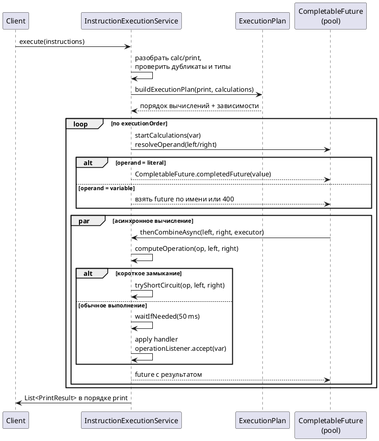

# Calculator Service Notes

## Что делает сервис
- Принимает строго упорядоченный список инструкций `calc` и `print` по HTTP (REST/OpenAPI) и gRPC.
- Находит только необходимые для вывода переменные, выстраивает их зависимости в топологическом порядке и вычисляет в несколько потоков.
- Каждая арифметическая операция имитирует задержку 50 мс; при очевидных результатах (`*` на 0/1, `+`/`-` с 0) срабатывает короткое замыкание без задержки.
- Одна переменная вычисляется ровно один раз; циклы, повторные определения и обращения к неопределённым переменным приводят к 400.

## Сборка и запуск

### Сборка и запуск через docker-compose, без установки Java
Проект полностью доступен в виде docker-compose.
Чтобы его собрать нужно запустить команду:
```bash
docker compose up --build
```
Полная сборка может занимать много времени (до 3 минут).
(Как я понял это обусловлено ограниченной пропускной способностью сети внутри контейнеров)

### Сборка и запуск с установленной Java 25
```bash
./mvnw clean install
./mvnw spring-boot:run
```

## Адреса
После запуска приложения будут доступны эндпоинты сваггера и grpc ui
- [Swagger UI](http://localhost:8080/swagger-ui/index.html)
- [Grpc UI](http://localhost:8081) (если запустили приложение через docker-compose)

## Архитектура и ключевые классы
- Используется spec-first подход с кодогенерации по контрактам. Сами контракты описаны в [calculator-openapi.yaml](src/main/resources/openapi/calculator-openapi.yaml) и [calculator.proto](src/main/resources/proto/calculator.proto).
- `InstructionExecutionService` — ядро вычислений: строит план, сортирует зависимости, поднимает `CompletableFuture` для параллельного исполнения, кэширует значения переменных. Для параллельной работы использует пул из 2 потоков.
- `CalculatorController` — HTTP-адаптер;
- `InstructionExecutorService` — gRPC-адаптер по proto `calculator.proto`.

## InstructionExecutionService: схема выполнения


## Поверхности API
- HTTP: `POST /api/v1/executions` (`src/main/resources/openapi/calculator-openapi.yaml`).
  - Пример:
    ```bash
    curl -X POST http://localhost:8080/api/v1/executions \
      -H 'Content-Type: application/json' \
      -d '{ "instructions": [
            {"type":"calc","op":"+","var":"x","left":10,"right":2},
            {"type":"calc","op":"*","var":"y","left":"x","right":5},
            {"type":"print","var":"y"} ] }'
    # => {"items":[{"var":"y","value":60}]}
    ```
- gRPC: сервис `calculator.api.v1.InstructionExecutor/Execute` (plaintext на 8080, proto лежит в `src/main/resources/proto/calculator.proto`).
  - Пример:
    ```bash
    grpcurl -plaintext -d '{
      "instructions":[
        {"calc":{"op":"OPERATION_SUBTRACT","var":"z","left":{"literal":5},"right":{"literal":3}}},
        {"print":{"var":"z"}}
      ]}' localhost:8080 calculator.api.v1.InstructionExecutor/Execute
    ```

## Поведение и валидация
- Порядок `print` в ответе соответствует входу; неиспользуемые вычисления пропускаются.
- Операнды: литералы `int64` либо ссылки на переменные; имена проверяются схемами OpenAPI/Proto.
- Ошибки домена (циклы, дубликаты, обращение к неопределённым переменным) → HTTP 400 / gRPC `INVALID_ARGUMENT`; остальные → 500.
- Генерированные исходники лежат в `target/generated-sources/{grpc,openapi}` и не редактируются руками.
